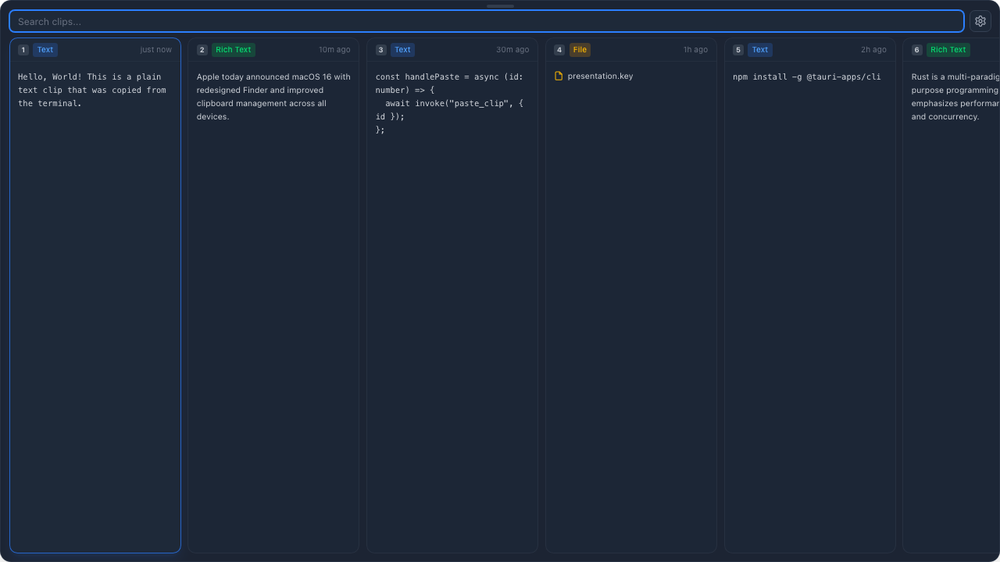

# ClipBin

> A lightweight clipboard manager for macOS with built-in screenshot editor.

🌐 [clipbin.app](https://clipbin.app) · ⬇ [Download](https://github.com/wwwppp0801/clipbin/releases/latest) · 📖 [Product Guide](docs/PRODUCT_GUIDE.md)



---

## Features

### Clipboard Management
- **Smart Capture** — Text, rich text (HTML), images, files, URLs, JSON auto-detected
- **Card Carousel UI** — Bottom-of-screen panel with horizontally scrollable cards
- **Instant Search** — Full-text search with SQLite FTS5 + result count
- **Click to Paste** — Paste into active app via simulated Cmd+V (like Maccy)
- **Pin Clips** — Pin important clips, survives clear and limit enforcement
- **Collections** — User-defined groups, organize clips via context menu
- **Source App Tracking** — Shows which app content was copied from
- **Deduplication** — SHA-256 hash, re-copies update timestamp + use count
- **Max Clips Limit** — Auto-delete oldest (configurable, default 500)
- **Ignored Apps** — Skip password managers (1Password, KeePassXC, etc.)
- **Export/Import** — Clipboard history as JSON for backup/migration
- **NSPasteboard.changeCount** — Efficient polling, skip unchanged clipboard

### Screenshot Editor
- **Cmd+Shift+A** — Capture screen area via macOS native screencapture
- **Annotation Tools** — Arrow, rectangle, circle, line, text
- **Color Picker** — Default red, full color selection
- **Font Size** — 16px to 72px for text annotations
- **Line Width** — 1-10px adjustable
- **Undo** — Cmd+Z support
- **Copy** — Copy edited result to clipboard + auto-close editor
- **Save** — Export as PNG file
- **WYSIWYG** — Annotations scale correctly regardless of retina resolution

### Keyboard Shortcuts (14)
| Shortcut | Action |
|----------|--------|
| `⇧⌘V` | Toggle clipboard panel (configurable) |
| `⇧⌘A` | Screenshot with editor |
| `1-9` | Quick paste Nth clip |
| `Enter` | Paste selected clip |
| `⌘C` | Copy to clipboard (no paste) |
| `⌘P` | Toggle pin |
| `⌘⇧V` | Paste as plain text |
| `← →` | Navigate cards |
| `Home/End` | Jump to first/last |
| `⌫` | Delete selected clip |
| `Tab` | Focus search input |
| `Esc` | Dismiss panel |
| `?` | Show keyboard shortcuts |
| `Dbl-click` | Preview full content |

### UI/UX
- **Slide Animations** — Entrance/exit from bottom of screen
- **Auto-hide** — Dismiss on blur, Escape, or click outside
- **Right-click Context Menu** — Paste, Pin, Add to Collection, Delete
- **Toast Notifications** — "Copied to clipboard" feedback
- **Footer Bar** — Clip count + Clear All (double-click confirm)
- **Number Badges** — First 9 cards show shortcut number
- **Content-aware Display** — URL link icon, JSON orange badge, file icon + filename
- **Double-click Preview** — Full content with Copy/Paste buttons + character count
- **Search Result Count** — Shows "N results" when filtering
- **Scroll Wheel** — Vertical scroll converts to horizontal in carousel

### Settings
- **Configurable Hotkey** — Record custom key combination
- **Max Clipboard History** — 10 to 10,000 items
- **Ignored Apps** — Comma-separated app names
- **Launch at Login** — Toggle auto-start (tauri-plugin-autostart)
- **Export/Import** — JSON backup buttons
- **Keyboard Shortcuts Reference** — All shortcuts listed
- **Version Display** — Current app version

## Tech Stack

| Layer | Technology |
|-------|-----------|
| UI | React 19 + TypeScript + Tailwind CSS 4 |
| Desktop | Tauri 2.0 |
| Backend | Rust (clipboard, paste, screenshot, settings) |
| Storage | SQLite via sqlx (FTS5, collections, migrations) |
| State | Zustand |
| Paste | Core Graphics CGEvent (Cmd+V simulation) |
| Screenshot | macOS screencapture + HTML Canvas editor |
| macOS APIs | NSPasteboard, NSScreen, NSWorkspace, NSRunningApplication |
| CI/CD | GitHub Actions (lint → test → build → release) |
| Website | Cloudflare Workers (i18n: EN/中文/日本語/한국어) |

## Project Structure

```
clipbin/
├── src/                        # React frontend
│   ├── App.tsx                 # Root: animations, events, toast, preview
│   ├── components/
│   │   ├── SearchBar.tsx       # Search input + result count + settings button
│   │   ├── ClipList.tsx        # Card carousel, keyboard nav, scroll wheel
│   │   ├── ClipCard.tsx        # Card: content preview, context menu, collections
│   │   ├── Footer.tsx          # Clip count + clear all
│   │   ├── PreviewDialog.tsx   # Full content preview with copy/paste
│   │   └── SettingsDialog.tsx  # All settings, shortcuts ref, export/import
│   ├── stores/
│   │   └── clipStore.ts        # Zustand: clips, search, pin, collections, toast
│   └── lib/
│       └── utils.ts            # formatTime, isUrl, isJson helpers
│
├── src-tauri/                  # Tauri + Rust backend
│   ├── src/
│   │   ├── main.rs             # Entry point
│   │   ├── lib.rs              # App setup: DB, tray, monitor, hotkeys, autostart
│   │   ├── clipboard.rs        # Polling, changeCount, HTML/file URL detection
│   │   ├── db.rs               # SQLite: clips, collections, FTS5, migrations
│   │   ├── paste.rs            # Clipboard write + CGEvent + app activation
│   │   ├── screenshot.rs       # Editor window, clipboard image, save/copy
│   │   ├── commands.rs         # All Tauri IPC commands
│   │   ├── models.rs           # Clip, ClipDto, ContentType, NewClip
│   │   ├── tray.rs             # System tray, window positioning, blur-hide
│   │   └── settings.rs         # JSON persistence, ignored apps
│   └── tauri.conf.json
│
├── public/
│   └── screenshot-editor.html  # Canvas-based annotation editor
│
├── tests/
│   ├── frontend/               # Vitest + React Testing Library (44 tests)
│   └── e2e/                    # Playwright (15 tests)
│
├── docs/
│   ├── PRODUCT_GUIDE.md        # Full product documentation
│   └── images/                 # Product screenshots
├── devlog/                     # Development logs + study notes
├── .github/workflows/          # CI + Release workflows
└── CLAUDE.md                   # Development conventions
```

## Development

### Prerequisites
- [Rust](https://rustup.rs/) (1.94+)
- [Node.js](https://nodejs.org/) (22+)
- [pnpm](https://pnpm.io/) (10+)
- Xcode Command Line Tools

### Setup
```bash
git clone https://github.com/wwwppp0801/clipbin.git
cd clipbin
pnpm install
```

### Run
```bash
pnpm tauri dev        # Full app (Rust + React)
pnpm dev              # Frontend only
```

### Test
```bash
# Rust (29 tests)
cd src-tauri && cargo test

# Frontend (44 tests)
pnpm test

# E2E (15 tests)
pnpm test:e2e

# Lint
pnpm lint
cd src-tauri && cargo clippy --all-targets -- -D warnings -A unexpected_cfgs
```

### Build
```bash
pnpm tauri build
# Output: src-tauri/target/release/bundle/dmg/ClipBin_0.1.0_aarch64.dmg
```

## Architecture

### Clipboard Monitoring
- `NSPasteboard.changeCount` for efficient change detection (like Maccy)
- Content priority: file URLs → HTML+text → text → image
- SHA-256 dedup, source app tracking, ignored apps filtering

### Paste Flow
1. Remember frontmost app PID (`NSWorkspace.frontmostApplication`)
2. Hide ClipBin window
3. Activate previous app (`NSRunningApplication.activateWithOptions`)
4. Write clipboard (arboard for text/image, NSPasteboard for file URLs)
5. Simulate Cmd+V (`CGEvent`)

### Screenshot Flow
1. `Cmd+Shift+A` → `screencapture -i -c` (macOS native)
2. Wait for completion → read image from clipboard
3. Open editor window with Canvas-based annotation tools
4. Copy → write annotated image to clipboard + close editor

### Window Management
- Positioned above Dock via `NSScreen.visibleFrame`
- Auto-hide on blur with 400ms grace period
- Slide-up/down CSS animations via Tauri events

## Links
- **Website**: [clipbin.app](https://clipbin.app)
- **GitHub**: [github.com/wwwppp0801/clipbin](https://github.com/wwwppp0801/clipbin)
- **Releases**: [Download DMG](https://github.com/wwwppp0801/clipbin/releases/latest)
- **Website Source**: [github.com/wwwppp0801/clipbin-site](https://github.com/wwwppp0801/clipbin-site)

## License

MIT
