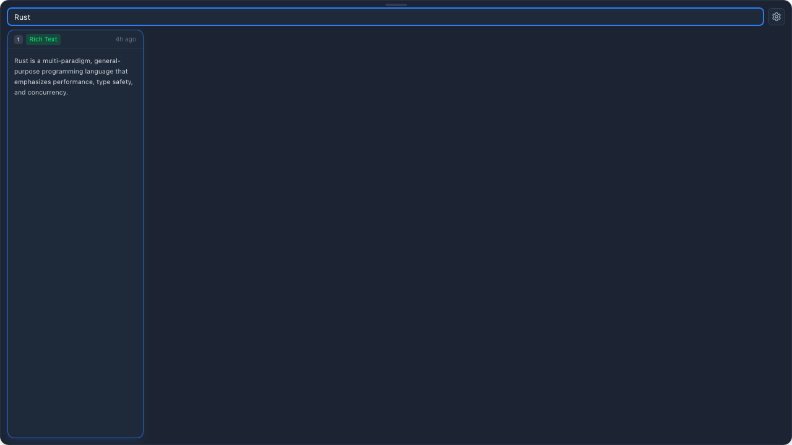
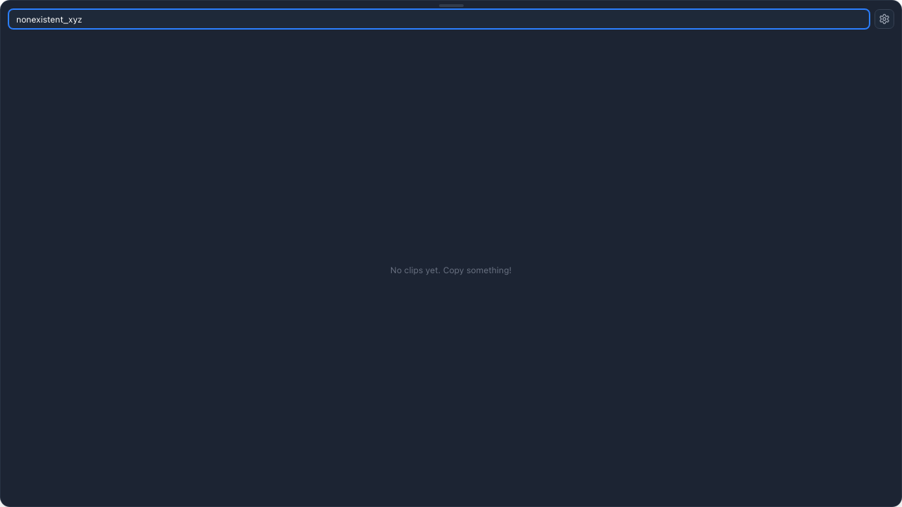

# ClipBin Product Guide

## Overview

ClipBin is a lightweight, fast clipboard manager for macOS. It runs silently in your menu bar, automatically captures everything you copy, and lets you instantly recall and paste any item from your clipboard history.

---

## Getting Started

### Installation

1. Download the latest `.dmg` from [GitHub Releases](https://github.com/wwwppp0801/clipbin/releases)
2. Drag ClipBin to your Applications folder
3. Launch ClipBin — it appears as a paperclip icon (📎) in your menu bar
4. Grant **Accessibility** permission when prompted (System Settings → Privacy & Security → Accessibility)

### First Use

ClipBin starts hidden. Simply copy anything — text, images, files — and ClipBin captures it automatically. Press **⇧⌘V** to open the clipboard panel.

---

## Main Interface

Press **⇧⌘V** (Shift + Cmd + V) to open the clipboard panel at the bottom of your screen:

The panel shows your clipboard history as a horizontal card carousel:

- **Drag handle** — The small gray bar at the top
- **Search bar** — Type to instantly filter your clipboard history
- **Settings button** (⚙) — Configure hotkey and history limit
- **Clip cards** — Each card shows one clipboard entry

### Card Anatomy

Each card displays:

| Element | Description |
|---------|-------------|
| **Number badge** (1-9) | Press the number key to instantly paste this clip |
| **Type badge** | Color-coded: **Text** (blue), **Rich Text** (green), **File** (amber), **Image** (purple) |
| **Timestamp** | When the content was copied (e.g., "just now", "10m ago") |
| **Content preview** | Text preview, filename, or image thumbnail |

---

## Search

Type in the search bar to filter clips by content. Search is instant with debounced input (200ms):

When no clips match your search, an empty state is shown:

Clear the search field to see all clips again.

---

## Pasting

There are three ways to paste a clip:

### 1. Click a Card
Click any card to paste its content into the previously active app. ClipBin will:
- Write the content to your system clipboard
- Activate the app you were using before opening ClipBin
- Simulate **⌘V** to paste

### 2. Number Keys (1-9)
Press a number key to instantly paste the corresponding clip. The first 9 clips show their number in the card header.

### 3. Keyboard Navigation
- **← →** Arrow keys to select a card
- **Enter** to paste the selected card
- **Esc** to dismiss without pasting

---

## Dismissing

The panel dismisses when you:
- Press **⇧⌘V** again (toggle)
- Press **Esc**
- Click anywhere outside the panel
- Paste a clip (auto-dismiss)

---

## Content Types

ClipBin automatically detects and categorizes what you copy:

| Type | Badge | Source Examples |
|------|-------|----------------|
| **Text** | Blue | Terminal commands, plain text, code |
| **Rich Text** | Green | Web page content (preserves formatting info) |
| **File** | Amber | Files copied in Finder (shows filename + icon) |
| **Image** | Purple | Screenshots, images from web/apps |

### File Clips
When you copy files in Finder, ClipBin shows the filename with a file icon. Pasting writes the file reference back to the clipboard so Finder can paste the actual file.

### Rich Text
Web page copies are detected as Rich Text. The plain text version is displayed in the card, but the clipboard retains the HTML content for rich pasting.

---

## Settings

Click the **⚙ gear icon** next to the search bar to open Settings:

### Toggle Hotkey
- Default: **⇧⌘V** (Shift + Cmd + V)
- Click the hotkey field, then press your desired key combination to change it

### Max Clipboard History
- Default: **500** items
- Range: 10 – 10,000
- Oldest non-pinned clips are automatically deleted when the limit is exceeded

---

## Context Menu

Right-click any card to see options:
- **Paste Original** — Paste with original formatting
- **Paste as Plain Text** — Strip formatting, paste text only
- **Delete** — Remove this clip from history

---

## Keyboard Shortcuts

| Shortcut | Action |
|----------|--------|
| **⇧⌘V** | Toggle clipboard panel (configurable) |
| **1-9** | Quick paste the Nth clip |
| **← →** | Navigate between cards |
| **Enter** | Paste selected card |
| **Esc** | Dismiss panel |

---

## Menu Bar

ClipBin lives in your macOS menu bar as a paperclip icon. Click it to toggle the panel. Right-click for:
- **Show/Hide ClipBin** — Toggle the panel
- **Quit ClipBin** — Exit the application

---

## Privacy & Permissions

### Accessibility Permission
Required for the paste simulation (⌘V). Without it, ClipBin can still copy to clipboard but cannot auto-paste into apps.

**How to enable:**
1. System Settings → Privacy & Security → Accessibility
2. Enable ClipBin (or the terminal app if running in dev mode)

### Data Storage
- Clipboard history is stored locally in `~/Library/Application Support/app.clipbin/clipbin.db`
- Settings stored in `~/Library/Application Support/app.clipbin/settings.json`
- **No data is sent to any server** — everything stays on your Mac

---

## Troubleshooting

| Issue | Solution |
|-------|----------|
| Hotkey doesn't work | Check if another app uses the same shortcut |
| Paste doesn't work | Grant Accessibility permission in System Settings |
| Panel hidden behind Dock | ClipBin uses `NSScreen.visibleFrame` — restart the app if Dock position changed |
| Icon not visible in menu bar | The paperclip icon uses template mode — it adapts to light/dark appearance |

---

## Tech Specs

- **Size**: ~15 MB (universal binary)
- **Memory**: ~30 MB idle
- **CPU**: < 1% (500ms polling interval)
- **macOS**: 10.15 Catalina or later
- **Architecture**: Apple Silicon (arm64) + Intel (x86_64)
